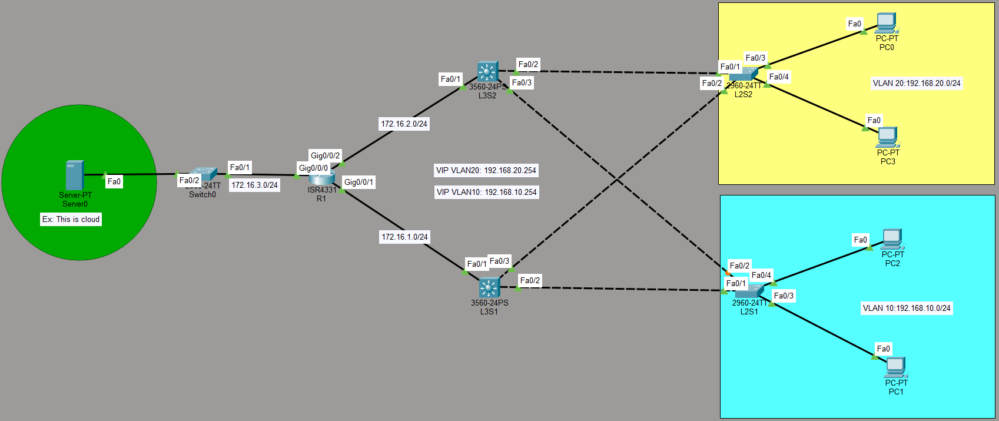

# FHRP - HSRP + EIGRP

Common Types of FHRP
HSRP (Hot Standby Router Protocol): A Cisco-proprietary protocol that uses an Active router to forward traffic, while a Standby router waits to take over if the Active router fails.

VRRP (Virtual Router Redundancy Protocol): An open-standard alternative to HSRP. It uses a Master router and backup routers.

GLBP (Gateway Load Balancing Protocol): A Cisco-proprietary protocol that not only provides redundancy but also load-balances traffic across multiple routers simultaneously.

## Network Topology



## Network Overview & Technical Specifications

*   **Core Router:** 1x Cisco ISR4331 (`R1`) routing traffic to the Server subnet (`172.16.3.0/24`).
*   **Core / Distribution Layer:** 2x Cisco 3560 Layer 3 Switches (`L3S1`, `L3S2`) handling HSRP and Inter-VLAN routing.
*   **Access Layer:** 2x Cisco 2960 Layer 2 Switches (`L2S1`, `L2S2`) distributing connectivity to end-user segments.
*   **First Hop Redundancy Protocol (FHRP):** Hot Standby Router Protocol (HSRP) configuration across L3 switches.
    *   **VIP VLAN 10:** `192.168.10.254`
    *   **VIP VLAN 20:** `192.168.20.254`

## Subnetting & VLAN Layout

| Subnet / VLAN | Description | Network Address | Default Gateway / VIP |
| :--- | :--- | :--- | :--- |
| **VLAN 10** | Blue Department (PC1, PC2) | `192.168.10.0/24` | `192.168.10.254` |
| **VLAN 20** | Yellow Department (PC0, PC3) | `192.168.20.0/24` | `192.168.20.254` |
| **Server Subnet** | Management Server (Server0) | `172.16.3.0/24` | `172.16.3.X` |
| **Transit Link 1** | R1 to L3S1 Link | `172.16.1.0/24` | N/A |
| **Transit Link 2** | R1 to L3S2 Link | `172.16.2.0/24` | N/A |

## VIP Config

```bash
!
hostname L3S1
!
interface Vlan10
 mac-address 00d0.d371.8501
 ip address 192.168.10.1 255.255.255.0  # Vlan10 IP Address
 standby version 2                      # Defind Version (2)
 standby 10 ip 192.168.10.254           # Shared Virtual IP
 standby 10 priority 110                # Higher priority = Active
 standby 10 preempt                     # Take over if rebooted
!
interface Vlan20
 mac-address 00d0.d371.8502
 ip address 192.168.20.1 255.255.255.0
 standby version 2
 standby 20 ip 192.168.20.254
 standby 20 priority 110
 standby 20 preempt
!

L3S1#show standby brief 
                     P indicates configured to preempt.
                     |
Interface   Grp  Pri P State    Active          Standby         Virtual IP
Vl10        10   110 P Active   local           192.168.10.2    192.168.10.254 
Vl20        20   110 P Active   local           192.168.20.2    192.168.20.254 

```

```bash
!
hostname L3S2
!
interface Vlan10
 mac-address 00e0.b011.0401
 ip address 192.168.10.2 255.255.255.0
 standby version 2
 standby 10 ip 192.168.10.254
!
interface Vlan20
 mac-address 00e0.b011.0402
 ip address 192.168.20.2 255.255.255.0
 standby version 2
 standby 20 ip 192.168.20.254
!
L3S2#show standby brief 
                     P indicates configured to preempt.
                     |
Interface   Grp  Pri P State    Active          Standby         Virtual IP
Vl10        10   100   Standby  192.168.10.1    local           192.168.10.254 
Vl20        20   100   Standby  192.168.20.1    local           192.168.20.254 

```
## EIGRP Config

```bash
Router R1
!
router eigrp 1
 redistribute static 
 network 172.16.1.0 0.0.0.255
 network 172.16.2.0 0.0.0.255
!
R1#show ip route 
Codes: L - local, C - connected, S - static, R - RIP, M - mobile, B - BGP
       D - EIGRP, EX - EIGRP external, O - OSPF, IA - OSPF inter area
       N1 - OSPF NSSA external type 1, N2 - OSPF NSSA external type 2
       E1 - OSPF external type 1, E2 - OSPF external type 2, E - EGP
       i - IS-IS, L1 - IS-IS level-1, L2 - IS-IS level-2, ia - IS-IS inter area
       * - candidate default, U - per-user static route, o - ODR
       P - periodic downloaded static route

Gateway of last resort is 0.0.0.0 to network 0.0.0.0

     172.16.0.0/16 is variably subnetted, 6 subnets, 2 masks
C       172.16.1.0/24 is directly connected, GigabitEthernet0/0/1
L       172.16.1.1/32 is directly connected, GigabitEthernet0/0/1
C       172.16.2.0/24 is directly connected, GigabitEthernet0/0/2
L       172.16.2.1/32 is directly connected, GigabitEthernet0/0/2
C       172.16.3.0/24 is directly connected, GigabitEthernet0/0/0
L       172.16.3.1/32 is directly connected, GigabitEthernet0/0/0
D    192.168.10.0/24 [90/25628160] via 172.16.1.2, 00:15:37, GigabitEthernet0/0/1
                     [90/25628160] via 172.16.2.2, 00:15:37, GigabitEthernet0/0/2
D    192.168.20.0/24 [90/25628160] via 172.16.1.2, 00:15:37, GigabitEthernet0/0/1
                     [90/25628160] via 172.16.2.2, 00:15:37, GigabitEthernet0/0/2
S*   0.0.0.0/0 is directly connected, GigabitEthernet0/0/0
!
```

```bash
Switch L3S1
!
router eigrp 1
 passive-interface FastEthernet0/2
 passive-interface FastEthernet0/3
 network 172.16.1.0 0.0.0.255
 network 192.168.20.0
 network 192.168.10.0
 no auto-summary
!
L3S1#show ip route 
Codes: C - connected, S - static, I - IGRP, R - RIP, M - mobile, B - BGP
       D - EIGRP, EX - EIGRP external, O - OSPF, IA - OSPF inter area
       N1 - OSPF NSSA external type 1, N2 - OSPF NSSA external type 2
       E1 - OSPF external type 1, E2 - OSPF external type 2, E - EGP
       i - IS-IS, L1 - IS-IS level-1, L2 - IS-IS level-2, ia - IS-IS inter area
       * - candidate default, U - per-user static route, o - ODR
       P - periodic downloaded static route

Gateway of last resort is 172.16.1.1 to network 0.0.0.0

     172.16.0.0/24 is subnetted, 2 subnets
C       172.16.1.0 is directly connected, FastEthernet0/1
D       172.16.2.0 [90/30720] via 172.16.1.1, 00:20:14, FastEthernet0/1
C    192.168.10.0/24 is directly connected, Vlan10
C    192.168.20.0/24 is directly connected, Vlan20
D*EX 0.0.0.0/0 [170/53760] via 172.16.1.1, 00:20:15, FastEthernet0/1
!
```
```bash
Switch L3S2
!
router eigrp 1
 passive-interface FastEthernet0/2
 network 192.168.10.0
 network 192.168.20.0
 network 172.16.2.0 0.0.0.255
 no auto-summary
!
L3S2#show ip route 
Codes: C - connected, S - static, I - IGRP, R - RIP, M - mobile, B - BGP
       D - EIGRP, EX - EIGRP external, O - OSPF, IA - OSPF inter area
       N1 - OSPF NSSA external type 1, N2 - OSPF NSSA external type 2
       E1 - OSPF external type 1, E2 - OSPF external type 2, E - EGP
       i - IS-IS, L1 - IS-IS level-1, L2 - IS-IS level-2, ia - IS-IS inter area
       * - candidate default, U - per-user static route, o - ODR
       P - periodic downloaded static route

Gateway of last resort is 172.16.2.1 to network 0.0.0.0

     172.16.0.0/24 is subnetted, 2 subnets
D       172.16.1.0 [90/30720] via 172.16.2.1, 00:20:55, FastEthernet0/1
C       172.16.2.0 is directly connected, FastEthernet0/1
C    192.168.10.0/24 is directly connected, Vlan10
C    192.168.20.0/24 is directly connected, Vlan20
D*EX 0.0.0.0/0 [170/53760] via 172.16.2.1, 00:20:55, FastEthernet0/1
!
```

## VLAN Config
```bash
Switch L3S1
L3S1#show vlan brief 

VLAN Name                             Status    Ports
---- -------------------------------- --------- -------------------------------
1    default                          active    Fa0/4, Fa0/5, Fa0/6, Fa0/7
                                                Fa0/8, Fa0/9, Fa0/10, Fa0/11
                                                Fa0/12, Fa0/13, Fa0/14, Fa0/15
                                                Fa0/16, Fa0/17, Fa0/18, Fa0/19
                                                Fa0/20, Fa0/21, Fa0/22, Fa0/23
                                                Fa0/24, Gig0/1, Gig0/2
10   IT                               active    
20   FN                               active    
1002 fddi-default                     active    
1003 token-ring-default               active    
1004 fddinet-default                  active    
1005 trnet-default                    active    
L3S1#
```

```bash
Switch L3S2
L3S2#show vlan brief 

VLAN Name                             Status    Ports
---- -------------------------------- --------- -------------------------------
1    default                          active    Fa0/4, Fa0/5, Fa0/6, Fa0/7
                                                Fa0/8, Fa0/9, Fa0/10, Fa0/11
                                                Fa0/12, Fa0/13, Fa0/14, Fa0/15
                                                Fa0/16, Fa0/17, Fa0/18, Fa0/19
                                                Fa0/20, Fa0/21, Fa0/22, Fa0/23
                                                Fa0/24, Gig0/1, Gig0/2
10   IT                               active    
20   FN                               active    
1002 fddi-default                     active    
1003 token-ring-default               active    
1004 fddinet-default                  active    
1005 trnet-default                    active    
```

```bash
Switch L2S1
L2S1#show vlan brief 

VLAN Name                             Status    Ports
---- -------------------------------- --------- -------------------------------
1    default                          active    Fa0/5, Fa0/6, Fa0/7, Fa0/8
                                                Fa0/9, Fa0/10, Fa0/11, Fa0/12
                                                Fa0/13, Fa0/14, Fa0/15, Fa0/16
                                                Fa0/17, Fa0/18, Fa0/19, Fa0/20
                                                Fa0/21, Fa0/22, Fa0/23, Fa0/24
                                                Gig0/1, Gig0/2
10   IT                               active    Fa0/3, Fa0/4
20   FN                               active    
1002 fddi-default                     active    
1003 token-ring-default               active    
1004 fddinet-default                  active    
1005 trnet-default                    active  
```
```bash
Switch L2S2
L2S2#show vlan brief 

VLAN Name                             Status    Ports
---- -------------------------------- --------- -------------------------------
1    default                          active    Fa0/5, Fa0/6, Fa0/7, Fa0/8
                                                Fa0/9, Fa0/10, Fa0/11, Fa0/12
                                                Fa0/13, Fa0/14, Fa0/15, Fa0/16
                                                Fa0/17, Fa0/18, Fa0/19, Fa0/20
                                                Fa0/21, Fa0/22, Fa0/23, Fa0/24
                                                Gig0/1, Gig0/2
10   IT                               active    
20   FN                               active    Fa0/3, Fa0/4
1002 fddi-default                     active    
1003 token-ring-default               active    
1004 fddinet-default                  active    
1005 trnet-default                    active  
```
## Trunk Port Config

```bash
Switch L3S1
L3S1#show interfaces trunk 
Port        Mode         Encapsulation  Status        Native vlan
Fa0/2       on           802.1q         trunking      1
Fa0/3       on           802.1q         trunking      1


Switch L3S2
L3S2#show interfaces trunk 
Port        Mode         Encapsulation  Status        Native vlan
Fa0/2       on           802.1q         trunking      1
Fa0/3       on           802.1q         trunking      1


