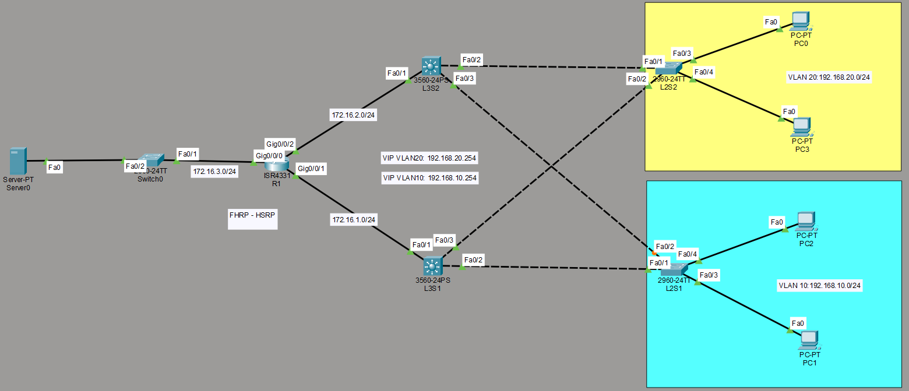

# FHRP - HSRP

Common Types of FHRP
HSRP (Hot Standby Router Protocol): A Cisco-proprietary protocol that uses an Active router to forward traffic, while a Standby router waits to take over if the Active router fails.

VRRP (Virtual Router Redundancy Protocol): An open-standard alternative to HSRP. It uses a Master router and backup routers.

GLBP (Gateway Load Balancing Protocol): A Cisco-proprietary protocol that not only provides redundancy but also load-balances traffic across multiple routers simultaneously.

## Network Topology

## Network Overview & Technical Specifications

*   **Core Router:** 1x Cisco ISR4331 (`R1`) routing traffic to the Server subnet (`172.16.3.0/24`).
*   **Core / Distribution Layer:** 2x Cisco 3560 Layer 3 Switches (`L3S1`, `L3S2`) handling HSRP and Inter-VLAN routing.
*   **Access Layer:** 2x Cisco 2960 Layer 2 Switches (`L2S1`, `L2S2`) distributing connectivity to end-user segments.
*   **First Hop Redundancy Protocol (FHRP):** Hot Standby Router Protocol (HSRP) configuration across L3 switches.
    *   **VIP VLAN 10:** `192.168.10.254`
    *   **VIP VLAN 20:** `192.168.20.254`

## Subnetting & VLAN Layout

| Subnet / VLAN | Description | Network Address | Default Gateway / VIP |
| :--- | :--- | :--- | :--- |
| **VLAN 10** | Blue Department (PC1, PC2) | `192.168.10.0/24` | `192.168.10.254` |
| **VLAN 20** | Yellow Department (PC0, PC3) | `192.168.20.0/24` | `192.168.20.254` |
| **Server Subnet** | Management Server (Server0) | `172.16.3.0/24` | `172.16.3.X` |
| **Transit Link 1** | R1 to L3S1 Link | `172.16.1.0/24` | N/A |
| **Transit Link 2** | R1 to L3S2 Link | `172.16.2.0/24` | N/A |